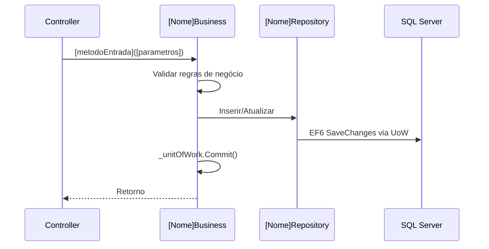

# Fases de Geração — doc-dev-from-po-doc

## Fase 1 — Extração e Análise do Documento PO

### 1.1 Identificação

| Campo | Extraído de |
|---|---|
| Produto | Sempre `VSEGURADORA` |
| Nome da funcionalidade | Título do documento ou campo "Identificação" |
| Domínio VSeguradora | Inferir pelo contexto (Cotação/Adesão/Sinistro/...) |
| ID único (FUNC-XXX) | Campo "ID" ou gerar sequencial se ausente |
| Versão do documento | Campo "Versão" ou "Version" |
| Endereço | Campo "Endereço" no cabeçalho — ex: `Área >> Login >> Menu >> Administrador >> Checklist` |
| Epic | Item imediatamente **após "Menu"** no Endereço — ex: `Administrador` |

### 1.2 Histórias de Usuário
Extrair todas as histórias no formato: "Como **[perfil]**, quero **[ação]**, para que **[objetivo]**."

### 1.3 Critérios de Aceitação
Mapear cada critério para: cenário happy path, cenário alternativo, cenário de erro.

### 1.4 Regras de Negócio
Extrair todas as restrições, validações, cálculos, condições e integrações mencionadas.

### 1.5 Entidades e Dados
- Entidades existentes que serão afetadas
- Novas entidades a criar
- Campos novos em entidades existentes (via script SQL manual em `VSEGURADORA.Infra.Database/`)

### 1.6 Protótipo da Interface (seção "5.")
- Lista de campos: Label, Tipo, Obrigatório, Tamanho/Máscara, Campo da Tabela
- Botões e comportamentos (Salvar, Voltar, Excluir, etc.)
- Mensagens de feedback esperadas

### 1.7 Estrutura da Entidade (seção "6.")
- Mapeamento Campo (C#) → Coluna (snake_case) → Tipo SQL → Obrigatório

### 1.8 Validações Necessárias (seção "7.")
- `[Required]` na entidade + validação no Business
- Custom `ValidationAttribute` ou regras no Business
- Regras de unicidade → query no Repository antes do INSERT

### 1.9 Rotina de Gravação de Dados (seção "8.")
- "Gerado pelo banco" → não incluir no payload; retornar após INSERT
- "Atribuído pelo sistema" → preencher no Business (`DateTime.Now`, usuário logado)
- "Campo da tela" → recebidos via model binding no Controller
- "Calculado pelo Business" → lógica no `Salvar()` antes da persistência

### 1.10 Multi-Tenancy (seção "10.")
- **Sem `id_tenant`** (tabela por banco de tenant) → não adicionar coluna nem filtro
- **Com `id_tenant`** (tabela compartilhada, excepcional) → adicionar propriedade + filtro
- `[MultiTenancyController]` deve ser aplicado **sempre** nos Controllers MVC

---

## Fase 2 — Mapeamento para Arquitetura VSeguradora

```
PO Doc
  ├─► Entidades de Domínio      → VSEGURADORA.Core.Entidades/Entidades/
  ├─► Interfaces Business       → VSEGURADORA.Core/Interfaces/
  ├─► Implementações Business   → VSEGURADORA.Core/Business/
  ├─► Interfaces Repository     → VSEGURADORA.Infra.Data/SIGA/Interfaces/
  ├─► Implementações Repository → VSEGURADORA.Infra.Data/SIGA/Repository/
  ├─► SIGAContext DbSet         → VSEGURADORA.Infra.Data/SIGA/Context/
  ├─► IUnitOfWork + UnitOfWork  → VSEGURADORA.Infra.Data/
  ├─► Actions no [Epic]Controller → VSEGURADORA.Apresentacao.Web/Controllers/
  ├─► Script SQL manual         → VSEGURADORA.Infra.Database/
  └─► Testes Unitários          → VSEGURADORA.Core.Tester/Testes/
```

| Situação | Ação |
|---|---|
| Entidade não existe | Criar entidade + todos os artefatos |
| Entidade existe, campo novo | Apenas adicionar propriedade + migration |
| Entidade existe, regra nova | Adicionar método ao Business existente |
| Entidade existe, endpoint API novo | Adicionar action ao Controller existente |
| Nova integração externa | Criar Gateway em `VSEGURADORA.Infra.Dados.Gateway` |

---

## Fase 3 — Documentação Técnica Confluence (tecnico-dev)

Gere o documento técnico completo no formato abaixo.

```markdown
# [Nome da Funcionalidade] — Documentação Técnica

**Status:** `[EM PRODUÇÃO / EM DESENVOLVIMENTO]`
**Domínio:** `[Domínio VSeguradora]`
**FUNC-ID:** `[FUNC-XXX]`
**Última revisão:** `[data atual]`
**Documento PO:** `[link para o doc de PO no Confluence]`

---

## 1. Visão Técnica

> Resumo técnico de 2-3 parágrafos.

| Camada | Projeto | Artefato principal |
|---|---|---|
| Apresentação | `VSEGURADORA.Apresentacao.Web` | `[Nome]Controller` |
| Negócio | `VSEGURADORA.Core` | `[Nome]Business`, `I[Nome]Business` |
| Dados | `VSEGURADORA.Infra.Data` | `[Nome]Repository` |
| Domínio | `VSEGURADORA.Core.Entidades` | `[Nome]` |
| Banco de Dados | SQL Server (EF6 Code-First) | `[nome_tabela]` |

## 2. Modelo de Dados

### 2.1 Estrutura da Entidade

| Propriedade C# | Coluna DB (snake_case) | Tipo SQL | Obrigatório | Descrição |
|---|---|---|---|---|
| `Id` | `id` | `INT PK` | Sim | Herdado de `EntidadeBase` |
| `DataAtualizacao` | `data_atualizacao` | `DATETIME` | Sim | Herdado de `EntidadeBase` |
| `[Propriedade]` | `[coluna_snake_case]` | `[tipo]` | Sim/Não | [descrição] |

> ⚠️ O nome da tabela em `[Table("...")]` deve ser **idêntico ao definido na seção 6 do PO** — NUNCA adicionar `tb_`.

### 2.2 Diagrama de Relacionamentos (Mermaid ER)

```mermaid
erDiagram
    [ENTIDADE_PRINCIPAL] { int id PK }
    [ENTIDADE_RELACIONADA] { int id PK }
    [ENTIDADE_PRINCIPAL] ||--o{ [ENTIDADE_RELACIONADA] : "tem"
```

### 2.3 Script SQL Manual

```sql
-- Arquivo: VSEGURADORA.Infra.Database/[NomeMigration].sql
CREATE TABLE [nome_tabela] (
    id          INT IDENTITY(1,1) NOT NULL PRIMARY KEY,
    [coluna]    [tipo] [NULL|NOT NULL],
    data_atualizacao DATETIME NOT NULL DEFAULT GETDATE()
);
```

## 3. Fluxo de Código



## 4. Regras de Negócio Implementadas

| Regra | Implementação | Localização |
|---|---|---|
| CA-01: [descrição] | `if (condicao) throw new BusinessException(...)` | `[Nome]Business.Salvar()` |

## 5. Injeção de Dependência (Unity)

```csharp
// Registro automático por convenção em UnityConfig.cs — nenhuma alteração necessária.
container.RegisterType<I[Nome]Business, [Nome]Business>(new HierarchicalLifetimeManager());
```

## 6. Tratamento de Erros

```csharp
// Erros de negócio:
throw new BusinessException("Mensagem descritiva em português.");
// Erros técnicos (apenas Controllers/infraestrutura):
throw;
```

## 7. Endpoints / Actions

| Método | Action | Parâmetros | Retorno | Autorização |
|---|---|---|---|---|
| GET | `[Epic]/[Nome]` | — | `View(IEnumerable<[Nome]>)` | `[Authorize]` |
| POST | `[Epic]/Salvar[Nome]` | `[Nome] entidade` | `Json { sucesso, mensagem }` | `[Authorize]` |
| POST | `[Epic]/Excluir[Nome]` | `int id` | `Json { sucesso, mensagem }` | `[Authorize]` |

## 8. Checklist de Scripts SQL

- [ ] `[NomeMigration].sql` criado
- [ ] Script executado em DEV
- [ ] Script executado em homologação
- [ ] Rollback documentado

## 9. Cobertura de Testes

| Cenário | Método | Status |
|---|---|---|
| Salvar — happy path | `Salvar_ComDadosValidos_DevePersistir` | ✅ / ❌ |
| Salvar — campo nulo | `Salvar_ComCampoNulo_DeveLancarExcecao` | ✅ / ❌ |
| Excluir — id existente | `Excluir_ComIdValido_DeveRemover` | ✅ / ❌ |

## 10. Troubleshooting

| Sintoma | Causa | Solução |
|---|---|---|
| `BusinessException` ao salvar | Violação de regra de negócio | Verificar `[Nome]Business.Salvar()` |
| `NullReferenceException` no Controller | Dependência não resolvida | Verificar `[Dependency]` |
| Registro não aparece após salvar | `Commit()` não chamado | Garantir `Commit()` ao final de toda escrita |
| Tabela não encontrada | Script não executado | Executar `[NomeMigration].sql` |

## 11. Decisões Técnicas

| Decisão | Justificativa |
|---|---|
| [Escolha de arquitetura] | [Motivo] |
```

---

## Fase 4 — Scaffold de Código (SOLID + Clean Code)

### Princípios SOLID no VSeguradora

| Princípio | Aplicação |
|---|---|
| **S** — Single Responsibility | Regras de negócio **nunca** no Controller ou Repository |
| **O** — Open/Closed | Adicionar comportamento via novos métodos, nunca modificando `GenericRepository` |
| **L** — Liskov Substitution | `[Nome]Repository` sempre substituível por `I[Nome]Repository` |
| **I** — Interface Segregation | Interfaces Business focadas; separar se necessário |
| **D** — Dependency Inversion | Controller depende de `I[Nome]Business`, nunca da concreção |

### Regras Clean Code obrigatórias

- **Nomes significativos em português** — `ListarAdesoesPendentes()`, não `GetData()`
- **Funções pequenas** — extrair métodos privados descritivos
- **DRY** — validação em 2+ lugares → método privado `Validar[Nome]()`
- **Fail Fast** — validações e guards no início do método
- **Sem magic numbers/strings** — usar constantes ou enums
- **Nulos explícitos** — `ArgumentNullException` com `nameof()` antes de qualquer operação

### Métodos herdados de BusinessBase (não reimplementar)

`Salvar(T)`, `Obter(int)`, `Listar()`, `Deletar(int)`, `getBussines(Type)` — já estão na base.

### Estrutura padrão do método Business

```csharp
public void Salvar([Nome] entidade)
{
    // 1. Guard clauses (Fail Fast)
    if (entidade == null)
        throw new ArgumentNullException(nameof(entidade), "[Nome] não pode ser nula.");

    // 2. Validações de negócio (métodos privados)
    ValidarRegrasDeNegocio(entidade);

    // 3. Enriquecimento
    entidade.DataAtualizacao = DateTime.Now;

    // 4. Persistência
    if (entidade.Id == 0)
        _repositorio.Inserir(entidade);
    else
        _repositorio.Atualizar(entidade);

    // 5. Commit sempre por último
    _unitOfWork.Commit();
}

private void ValidarRegrasDeNegocio([Nome] entidade)
{
    if (entidade.Id[EntidadeRelacionada] <= 0)
        throw new BusinessException("[EntidadeRelacionada] é obrigatória.");
}
```

### Artefatos gerados (nesta ordem)

1. `VSEGURADORA.Core.Entidades/Entidades/[Nome].cs`
2. `VSEGURADORA.Infra.Data/SIGA/Interfaces/I[Nome]Repository.cs`
3. `VSEGURADORA.Infra.Data/SIGA/Repository/[Nome]Repository.cs`
4. `VSEGURADORA.Core/Interfaces/I[Nome]Business.cs`
5. `VSEGURADORA.Core/Business/[Nome]Business.cs`
6. Trecho `DbSet<[Nome]>` para `SIGAContext.cs`
7. `case "I[Nome]Repository":` no switch de `UnitOfWork.cs`
8. `case "I[Nome]Business":` no switch de `BusinessBase.cs`
9. Actions no `[Epic]Controller`
10. Entrada no `Mvc.sitemap`
11. `[NomeMigration].sql` em `VSEGURADORA.Infra.Database/`

---

## Fase 5 — Testes Unitários (MSTest + Moq)

```csharp
[TestClass]
[TestCategory("[Nome]Business")]
public class [Nome]BusinessTester
{
    private Mock<IUnitOfWork> _mockUoW;
    private Mock<I[Nome]Repository> _mockRepository;
    private [Nome]Business _business;

    [TestInitialize]
    public void Setup()
    {
        AutenticacaoHelper.isTest = true;
        AutenticacaoHelper.usuarioTest = new Usuario { Id = 1, Nome = "Usuário Teste", Login = "teste" };

        _mockRepository = new Mock<I[Nome]Repository>();
        _mockUoW = new Mock<IUnitOfWork>();
        _mockUoW.Setup(u => u.[Nome]s).Returns(_mockRepository.Object);
        _business = new [Nome]Business(_mockUoW.Object);
    }

    [TestMethod]
    public void Salvar_ComDadosValidos_DeveInserirECommit()
    {
        var entidade = new [Nome] { /* propriedades mínimas válidas */ };
        _business.Salvar(entidade);
        _mockRepository.Verify(r => r.Inserir(It.IsAny<[Nome]>()), Times.Once);
        _mockUoW.Verify(u => u.Commit(), Times.Once);
    }

    [TestMethod]
    [ExpectedException(typeof(ArgumentNullException))]
    public void Salvar_ComEntidadeNula_DeveLancarArgumentNullException()
    {
        _business.Salvar(null);
    }

    [TestMethod]
    [ExpectedException(typeof(BusinessException))]
    public void Salvar_ComRegraDeNegocioViolada_DeveLancarBusinessException()
    {
        var entidade = new [Nome] { /* campo inválido */ };
        _business.Salvar(entidade);
    }

    [TestMethod]
    public void Excluir_ComIdValido_DeveDeletarECommit()
    {
        _mockRepository.Setup(r => r.ObterPorId(It.IsAny<int>()))
                        .Returns(new [Nome] { Id = 1 });
        _business.Excluir(1);
        _mockRepository.Verify(r => r.Deletar(1), Times.Once);
        _mockUoW.Verify(u => u.Commit(), Times.Once);
    }

    // Um teste por critério de aceitação (CA-01, CA-02, ...)
}
```
